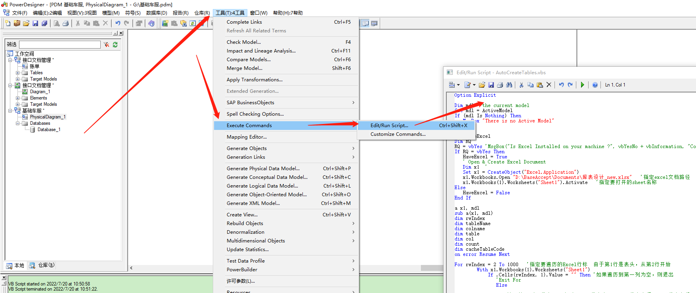
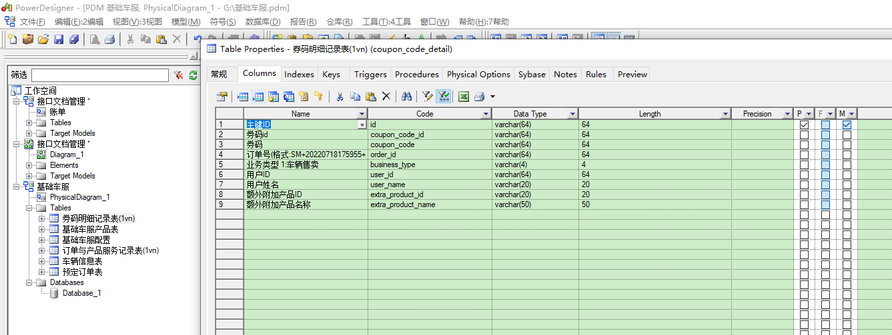

# 根据业务讨论生成数据表结构（Excel → PDM）流程说明

在完成业务流程与逻辑讨论后，需要通过可视化的数据模型来确保数据库设计能够满足业务需求。为此，我们计划按照以下步骤进行数据表结构设计与确认。

## 1. 根据业务需求编制 Excel 表结构文档

首先，将各个业务流程中涉及的数据实体、字段及其关系梳理清楚，并整理到一份结构化的 Excel 文档中。Excel 将包含：

* **待创建的数据库表列表**
* **各表的字段明细**，包括：

    * 字段名称
    * 字段类型
    * 主键/外键标识
    * 是否允许为空
    * 默认值
    * 字段说明（业务含义）
* **表之间的关联关系说明**
```shell
| type  | name         | code          | datatype        | comment                     | pk |
|-------|--------------|----------------|------------------|------------------------------|----|
| table | 用户表        | t_user         |                  | 用户信息存储表               |    |
| field | 主键ID       | id             | bigint           | 主键                         | Y  |
| field | 用户名        | username       | varchar(64)      | 用户登录名                    |    |
| field | 昵称         | nickname       | varchar(128)     | 展示用昵称                    |    |
| field | 创建时间      | create_time    | datetime         | 创建记录时间                  |    |
| field | 更新时间      | update_time    | datetime         | 更新记录时间                  |    |
| table | 订单表        | t_order        |                  | 用户订单记录表               |    |
| field | 主键ID       | id             | bigint           | 主键                         | Y  |
| field | 用户ID       | user_id        | bigint           | 关联 t_user.id               |    |
| field | 订单金额      | amount         | decimal(10,2)    | 订单金额                      |    |
| field | 状态         | status         | int              | 订单状态：0-未支付，1-已支付  |    |
| exit  |              |                |                  |                              |    |

```
[pdm_excel_template.xlsx](通过excel文档快速生成表设计/pdm_excel_template.xlsx)
该 Excel 用于作为数据库设计的初稿，方便校验字段是否完整、命名是否规范、业务含义是否明确。

## 2. 将 Excel 表结构转为 PDM（PowerDesigner 数据模型）

在整理好 Excel 后，将其导入或手工录入至 PowerDesigner（或其他数据建模工具）中，生成可视化的 PDM 模型。转换后的 PDM 可以：

* 展现表之间的 **ER 图**（实体关系图）
* 清晰标注主外键关系
* 自动检查字段类型、长度、约束是否合理
* 为后续生成建表 SQL、影响分析或迭代设计提供基础

通过 PDM 能更直观地验证数据库结构是否符合业务逻辑和扩展需求。

```shell
Option Explicit
 
Dim mdl ' the current model
Set mdl = ActiveModel
If (mdl Is Nothing) Then
   MsgBox "There is no Active Model"
End If
 
Dim HaveExcel
Dim RQ
RQ = vbYes 'MsgBox("Is Excel Installed on your machine ?", vbYesNo + vbInformation, "Confirmation")
If RQ = vbYes Then
   HaveExcel = True
   ' Open & Create Excel Document
   Dim x1  '
   Set x1 = CreateObject("Excel.Application")
   x1.Workbooks.Open "D:\BaseAccept\Documents\库表设计_new.xlsx"   '指定excel文档路径
   x1.Workbooks(1).Worksheets("Sheet1").Activate   '指定要打开的sheet名称
Else
   HaveExcel = False
End If
 
a x1, mdl
sub a(x1, mdl)
dim rwIndex   
dim tableName
dim colname
dim table
dim col
dim count
dim cacheTableCode
on error Resume Next
 
For rwIndex = 2 To 1000   '指定要遍历的Excel行标  由于第1行是表头，从第2行开始
        With x1.Workbooks(1).Worksheets("Sheet1")
            If .Cells(rwIndex, 1).Value = "" Then '如果遍历到第一列为空，则退出
               'Exit For
               Else
               
                  '读取第一列  代表type类型 table代表表  remake代表注释 field代表字段  空代表无需处理
            
                  If .Cells(rwIndex, 1).Value = "table" Then 'table代表表
                      set table = mdl.Tables.CreateNew     '创建表
                      table.Name = .Cells(rwIndex , 2).Value '指定表名
                      table.Code = .Cells(rwIndex , 3).Value 
                      table.Comment = .Cells(rwIndex , 5).Value '指定表注释
                      count = count + 1  
              
                  ElseIf .Cells(rwIndex, 1).Value = "field" Then '字段
                      set col = table.Columns.CreateNew   '创建一列/字段
                     'MsgBox .Cells(rwIndex, 1).Value, vbOK + vbInformation, "列"            
                        col.Name = .Cells(rwIndex, 2).Value   '指定列名       
                     'MsgBox col.Name, vbOK + vbInformation, "列"
                     col.Code = .Cells(rwIndex, 3).Value   '指定列名                        
                     col.DataType = .Cells(rwIndex, 4).Value '指定列数据类型           
                       'MsgBox col.DataType, vbOK + vbInformation, "列类型"               
                     col.Comment = .Cells(rwIndex, 5).Value  '指定列说明
                  'col.Precision = .Cells(rwIndex, 6).Value  '精度
                  If .Cells(rwIndex,6).Value="Y" Then
                    col.Primary  = true  '是否主键
                     
                     ElseIf .Cells(rwIndex,6).Value = "" Then
                           '如果标记主键是空,默认就看是不是id字段 如果是id 那么也当主键
                           If .Cells(rwIndex, 3).Value="id"  Then
                              col.Primary  = true  '是否主键
                           End If
                        
                     End If
                     
                  ElseIf .Cells(rwIndex, 1).Value = "exit" Then '退出
                     Exit For
               
                  End If
               
               
            End If
            
        End With
Next
MsgBox "生成数据表结构共计 " + CStr(count), vbOK + vbInformation, "表"
 
Exit Sub
End sub
```
## 3. 结构确认与后续输出

完成 PDM 后，可以组织开发/业务/测试共同评审，重点确认：

* 字段是否覆盖全部业务场景
* 表之间关系是否正确
* 命名是否规范、一致
* 是否存在冗余或缺失的数据结构

最终确认无误后，可基于 PDM 导出：

* 建表 SQL
* 模型文档
* 字段字典
* 后续开发所需的数据库初始化脚本
* 
