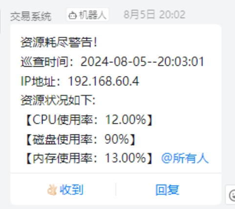
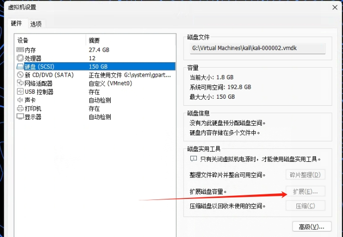
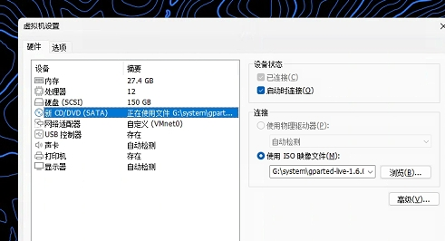
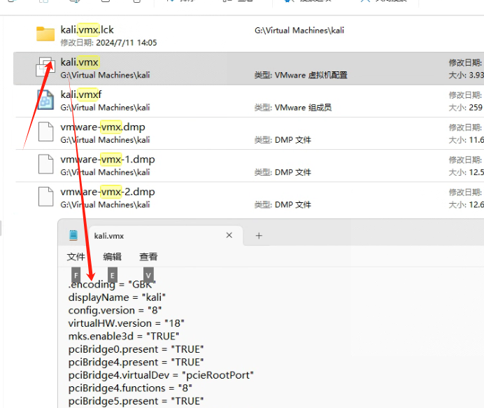
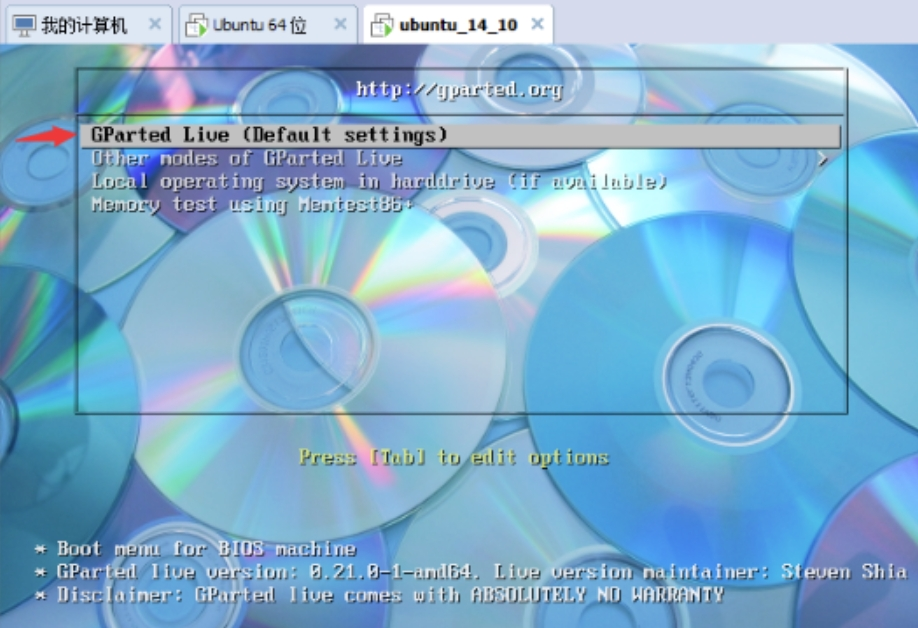
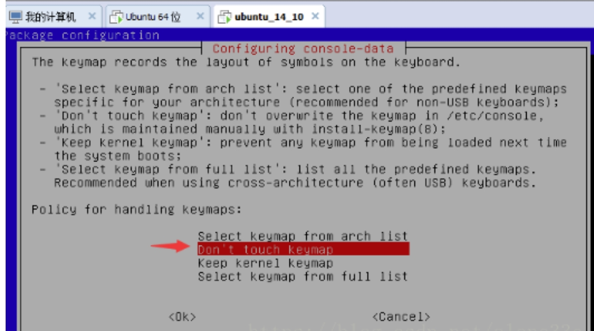
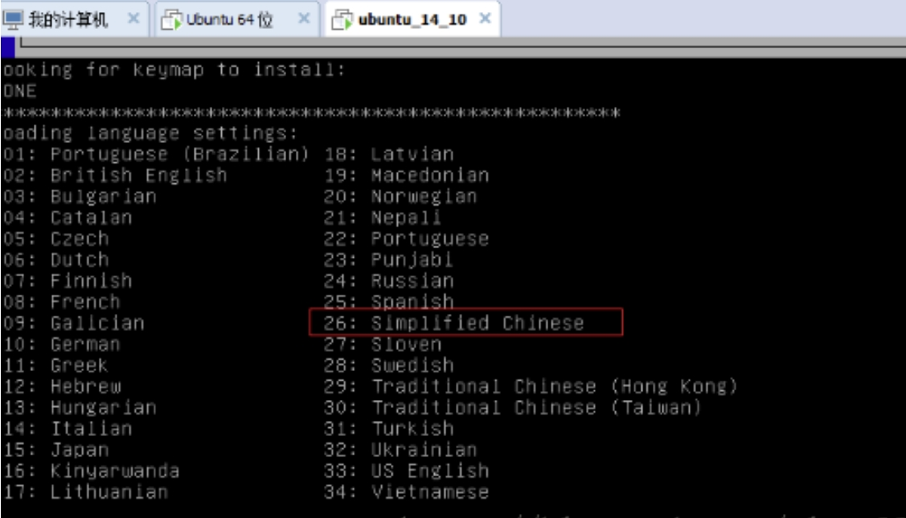
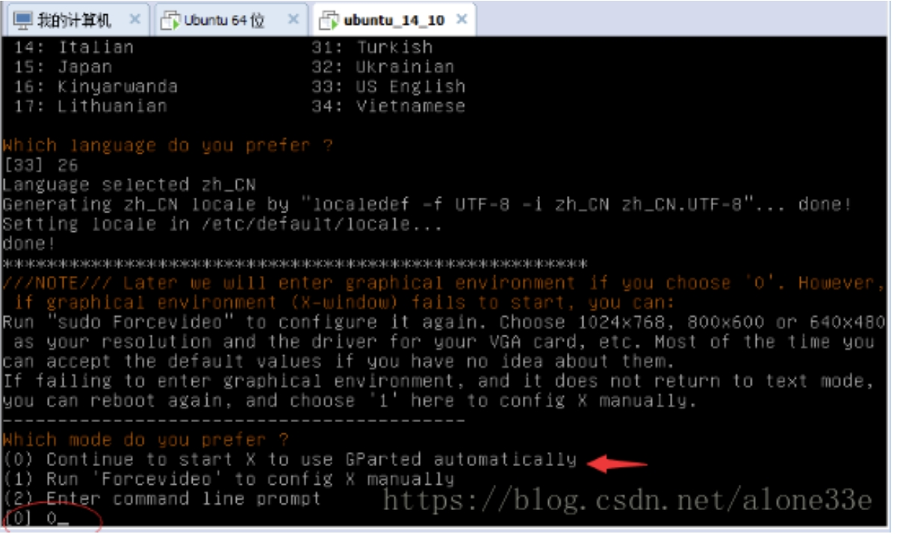
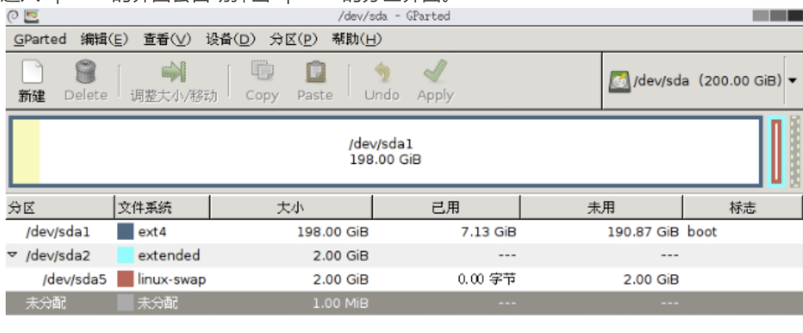

磁盘空间不足的提示。
我就在终端输入df -h查看了一下磁盘的使用情况。
文件系统        容量  已用  可用 已用% 挂载点
udev             14G     0   14G    0% /dev
tmpfs           2.7G  1.8M  2.7G    1% /run
/dev/sda1        48G   46G   47M  100% /
tmpfs            14G     0   14G    0% /dev/shm
tmpfs           5.0M     0  5.0M    0% /run/lock
tmpfs           2.7G   60K  2.7G    1% /run/user/130
tmpfs           2.7G   52K  2.7G    1% /run/user/0
overlay          48G   46G   47M  100% /var/lib/docker/overlay2/40d9810bdeacf6f8af191b96880582457507055ac701cddc05c90bd41a4cc8cd/merged
overlay          48G   46G   47M  100% /var/lib/docker/overlay2/684b310e0e5d6cd40b0003fea2920d176d49aacacba87d1364dc0f0aa26d429d/merged
overlay          48G   46G   47M  100% /var/lib/docker/overlay2/71c3fc9620d502f60d702b4a0227cb0ccfe86a05f75c0627a261ac1357a28867/merged
overlay          48G   46G   47M  100% /var/lib/docker/overlay2/3491e006468ecf31bc09cfe8d4ecef08bb37d93d2678f919e0e57f02b76c7cc6/merged

发现/dev/sda1这个文件系统的使用率打到了90%以上，我就想着给他扩一下容。
网上各种找方法….
网上一堆复制粘贴的坑逼教程可把我给坑惨了。
最后找到了两篇文章综合起来才成功。
写出来的目的仅仅为了方便记忆，那么就来说说吧。
第一步:
使用VMware图像界面工具，对磁盘进行扩容。这一步要先将你的ubantu关机后才可以进行。（必须删除所有快照）点击拓展后就可以指定磁盘大小了。值得注意的是，这里指定的磁盘大小并不是立马分出你给定的磁盘大小。而是给了一个容量上限，你用多少就消耗本机多少空间。所以指定大一点也没关系。

第二步:
下载Gparted镜像文件。
https://jaist.dl.sourceforge.net/project/gparted/gparted-live-testing/1.6.0-3/gparted-live-1.6.0-3-amd64.iso?viasf=1

然后在虚拟机的设置–CD/DVD(SATA)里， 在”启动时连接”前打钩 并选择 上面下载好的 Gparted 镜像， 如下图：

第三步:
启动BIOS方法:
用记事本打开ubantu.vmx文件，在第一行添加这段代码
bios.forceSetupOnce = “TRUE”

保存再打开就可以进入BIOS，这个设置时一次性的，在你开机后这段代码会自动消失，所以设置完之后就不用管了。

进入BIOS后用←→键选择进入BOOT，然后用↑↓选择到CD-ROM drive，再按” + “号把它一到第一位。然后按F10保存退出。

开机后即可进入这个界面。

输入26选择简体中文，敲回车

输入0，敲回车

进入Gparted的界面会自动弹出Gparted的分区界面。

依次删除 linux-swap项， extended项， 最后只剩下sda1和未分配， 然后右键”sda1”项进行调整大小，
将磁盘容量调整到合适的大小最好是1024的整数倍，并预留空间(2-4G)作为交换区，交换区的大小为你系统内存的大小。 
再右键”未分配”进行扩展分区出extended分区，然后新建逻辑分区linux-swap，操作完成后点击APPLY提交。然后退出 
然后正常启动你的ubantu，再次输入命令df -h查看扩容是否成功

└─# df -h     
文件系统        容量  已用  可用 已用% 挂载点
udev             14G     0   14G    0% /dev
tmpfs           2.7G  1.8M  2.7G    1% /run
/dev/sda1       144G   34G  104G   25% /
tmpfs            14G     0   14G    0% /dev/shm
tmpfs           5.0M     0  5.0M    0% /run/lock
tmpfs           2.7G   60K  2.7G    1% /run/user/130
overlay         144G   34G  104G   25% /var/lib/docker/overlay2/71c3fc9620d502f60d702b4a0227cb0ccfe86a05f75c0627a261ac1357a28867/merged
overlay         144G   34G  104G   25% /var/lib/docker/overlay2/684b310e0e5d6cd40b0003fea2920d176d49aacacba87d1364dc0f0aa26d429d/merged
overlay         144G   34G  104G   25% /var/lib/docker/overlay2/40d9810bdeacf6f8af191b96880582457507055ac701cddc05c90bd41a4cc8cd/merged
overlay         144G   34G  104G   25% /var/lib/docker/overlay2/3491e006468ecf31bc09cfe8d4ecef08bb37d93d2678f919e0e57f02b76c7cc6/merged
tmpfs           2.7G   56K  2.7G    1% /run/user/0
overlay         144G   34G  104G   25% /var/lib/docker/overlay2/930ee5b9896adee4a28eec7579f04eda6b9fb74888d7c2fb13d4834d6164d782/merged